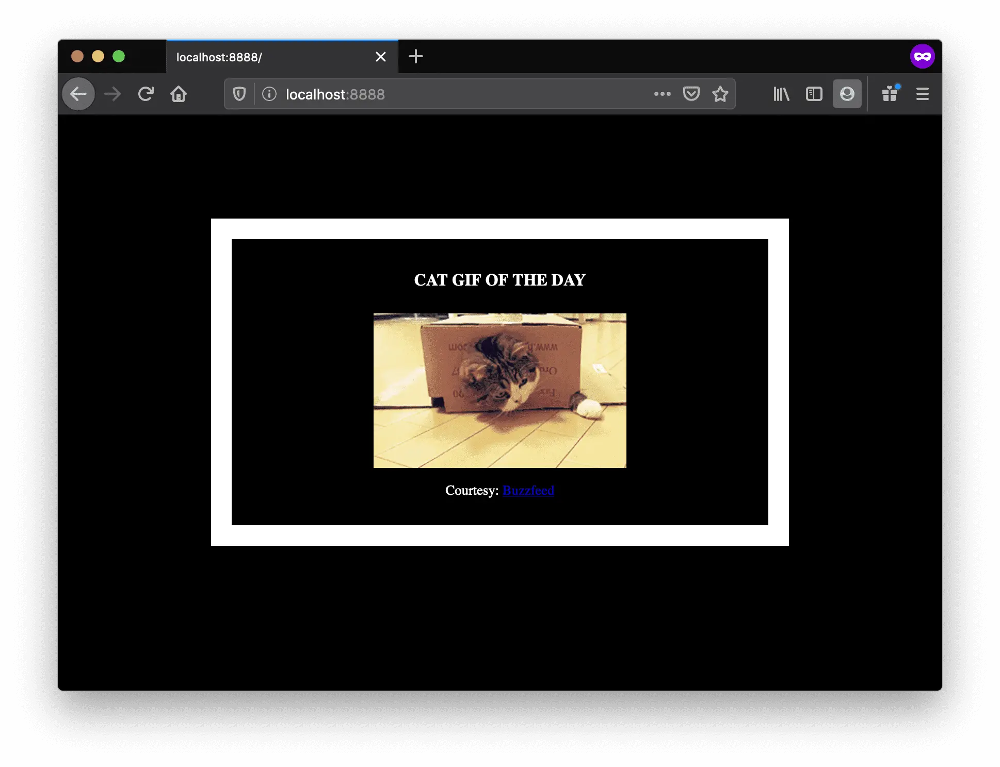
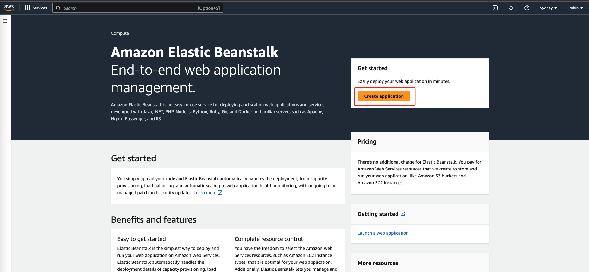
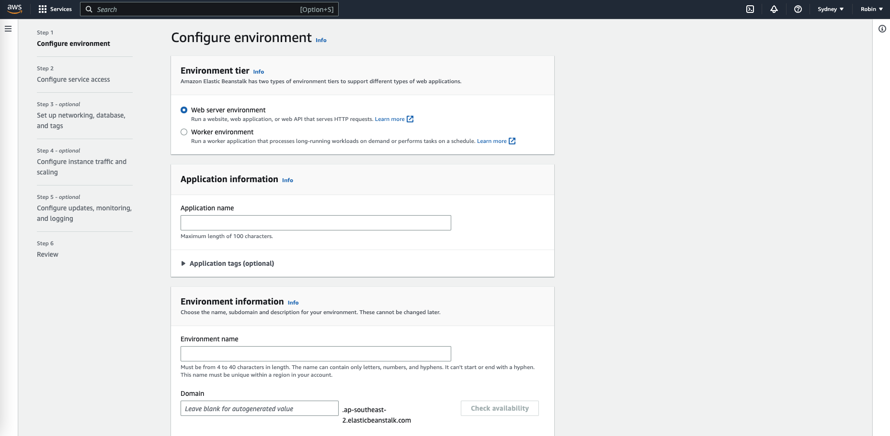
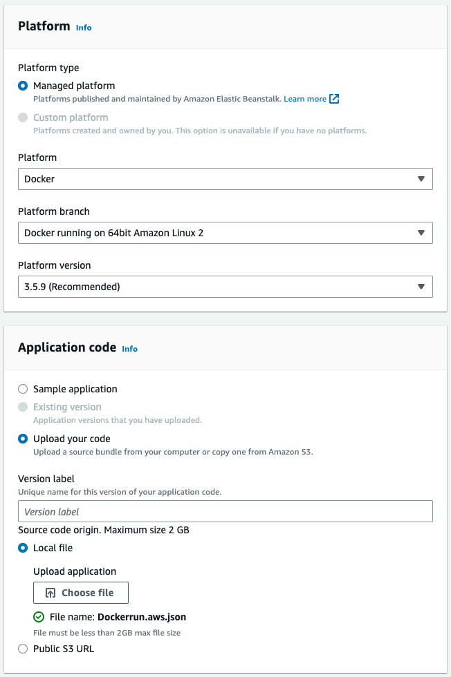
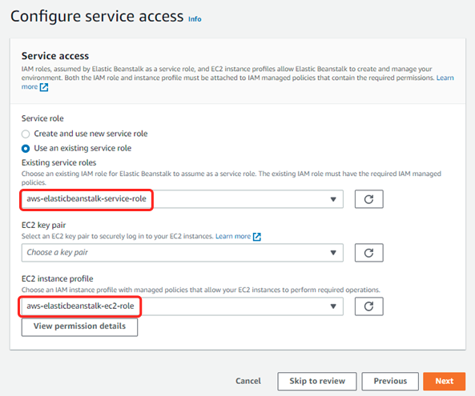
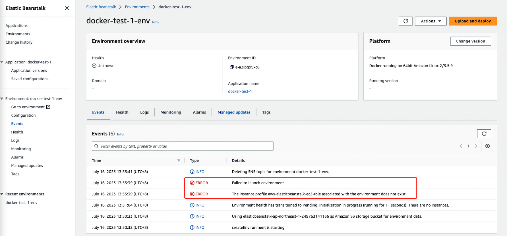
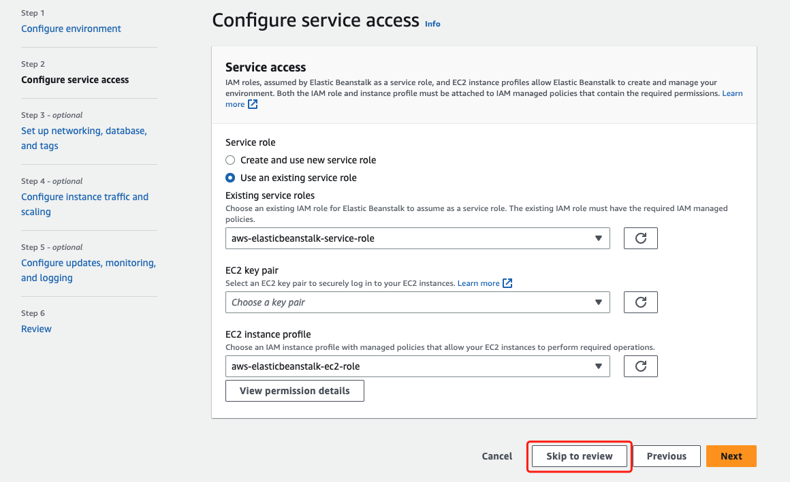
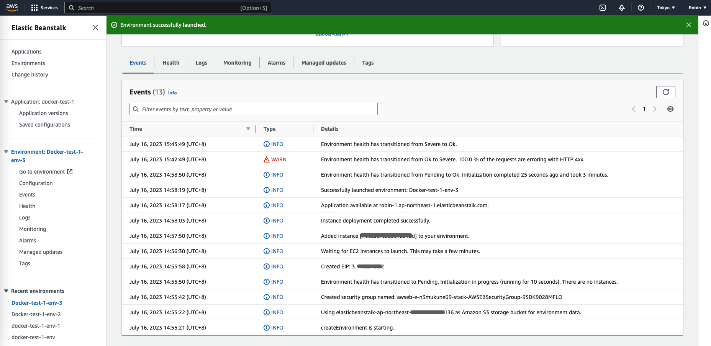
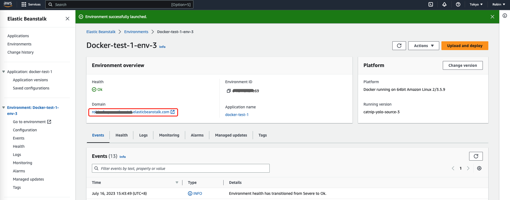

<blockquote class="wp-block-quote">
  

    本文假设读者具有Docker基础知识，着重介绍如何在AWS上运行一个简单的Web程序。如果缺乏Docker基础知识，可以通过参考资料「1」的“傻瓜级”教程学习。
  

</blockquote>

## 本地运行Image {.wp-block-heading}

首先我已经在将这个程序的docker image 上传到了我的[Docker Hub][1]。首先你可以在本地验证这个docker image是否能正常运行。

<pre class="wp-block-code"><code lang="bash" class="language-bash">$ docker run -p 8888:5000 robinliug/catnip
 * Running on all addresses (0.0.0.0)
 * Running on http://127.0.0.1:5000
 * Running on http://172.17.0.2:5000</code></pre>

容器使用端口5000在Docker内部中运行，可以通过8888端口在外部访问该容器。

当你在能在本地浏览器捕获随机捕获一只小猫咪后，可以准备在AWS上部署该Image了。

## 云上运行Image {.wp-block-heading}

我们使用AWS Elastic Beanstalk(EB)运行这个程序，EB是一个AWS提供的PaaS，国内的云厂商也提供了类似的平台。值得一提的是，AWS允许新用户免费试用一年的所有类型产品。

以下是一些步骤：

### 1 创建账号 {.wp-block-heading}

在[AWS][2]创建个人账号，如果有任何创建账号问题都可以联系客服。我当时跟线上客服反馈收不到验证码，然后客服就从美国给我打了个国际电话来帮我解决了。

### 2 创建Application {.wp-block-heading}

在[EB][3]创建Application。

可以创建多个Application，每一个Application下可以创建多个Environment。

这里的名字可以根据个人喜好填，比较重要的是后面的内容。

### 3 创建Environment {.wp-block-heading}

平台选择Docker，并且使用我们自己提供的AWS Docker运行环境配置文件。

配置文件名为Dockerrun.aws.json，内容如下：

<pre class="wp-block-code"><code lang="json" class="language-json">{
  "AWSEBDockerrunVersion": "1",
  "Image": {
    "Name": "robinliug/catnip",
    "Update": "true"
  },
  "Ports": [
    {
      "ContainerPort": 5000,
      "HostPort": 8000
    }
  ],
  "Logging": "/var/log/nginx"
}</code></pre>

步骤二（配置服务权限）稍微复杂一点，需要选择正确的Existing service roles和EC2 instance profile。

如果没选择正确的配置，最后在Environment生成的时候会出现以下错误：

有个很详细的[官方文档][4]告诉我们怎么配置这块，最主要的就是配置EC2的3个IAM权限：

  * `AWSElasticBeanstalkWebTier`
  * `AWSElasticBeanstalkWorkerTier`
  * `AWSElasticBeanstalkMulticontainerDocker`

步骤二完成后，可以直接跳去确认页提交所有配置

Environment发布成功后的页面大致就是这样：

最后你就可以通过Environment提供的链接，随机捕获你的小猫咪啦！

**参考资料**

1. [A Docker Tutorial for Beginners][5]  
2. [AWS EB Create an example application][4]

 [1]: https://hub.docker.com/r/robinliug/catnip
 [2]: https://aws.amazon.com
 [3]: https://console.aws.amazon.com/elasticbeanstalk
 [4]: https://docs.aws.amazon.com/elasticbeanstalk/latest/dg/GettingStarted.CreateApp.html#GettingStarted.CreateApp.AWSresources
 [5]: https://docker-curriculum.com/#introduction