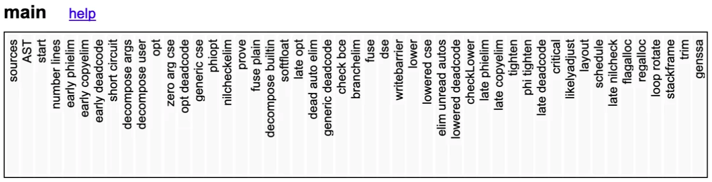

2月初做了个「优化项目编译效率」的技术需求，达到的效果：编译微服务的内存使用率从最高8-9G下降到了1-2G，编译时间从平均70-80s下降到55-60s。

在查阅了官方资料，及结合自身的分析、实操后，总结了这篇文章。文章记录了我思考、解决问题的过程，如果你有更好的思路，欢迎交流讨论。文章除了简述解决思路外，还介绍了一些工具来辅助分析问题，最后也对编译原理做了概述。

## 背景 {.wp-block-heading}

在生产环境构建微服务时构建机出现过几次「自动停止构建」的现象，其原因是执行`go build`指令开始编译代码时发生内存溢出，服务器直接kill掉了编译指令的进程。<figure class="wp-block-image size-large">

## 分析 {.wp-block-heading}

`go build`会编译所有的依赖（包括自身项目其他包的代码、第三方依赖包的代码），我找了1个导入第三方依赖包最少的微服务，查看了第三方依赖包的代码，没有发现代码量特别巨大。那么有可能问题是出现在自身项目的代码里，于是我借助工具生成了一份可视化的依赖关系图，协助排查问题。

### 梳理依赖关系 {.wp-block-heading}

<pre class="wp-block-code"><code class=""># 使用godepgraph为go项目生成dot脚本形式的依赖树
go install github.com/kisielk/godepgraph@latest

# 使用graphviz将依赖树生成可视化依赖关系图
brew install graphviz

# 生成可视化依赖关系图
godepgraph -s -p github.com,google.golang.org,go.opentelemetry.io,gorm.io,golang.org,go.uber.org,gopkg.in,cloud.google,***/gomod/ ***/server/src/mizos/ipinfo | dot -Tsvg -o ipinfo.svg</code></pre>

先来解释一下第三条指令：

  * 里面的\***是项目地址
  * -s: 忽略掉go标准库依赖包，如：fmt, time&#8230;.
  * -p: 忽略指定开头的依赖包，例如：-p github.com,google.golang.org的作用是忽略github.com和google.golang.org开头的依赖包
  * graphviz安装完成后，就可以使用dot指令根据dot脚本生成可视化图片
  * 将godepgraph生成的dot脚本通过管道命令`|`给dot指令使用。图片格式用-T指定，我这里用输出svg格式；输出文件名用-o指定，我这里叫ipinfo.svg

依次执行完上面的指令后会生成一份名为ipinfo.svg的可视化依赖关系图，如下：<figure class="wp-block-image size-large">

因为用-s -p执行过滤了标准库和第三方依赖，剩下的就都是以我项目开头的依赖包。从这个依赖包可以看出该服务的依赖是存在问题的，图中黄色的包都是其他微服务的代码，严格来说不应该这样使用，这是后面二期优化要解决的问题。

重要的是通过依赖找到了两个文件，每个文件占用磁盘7MB左右，这个量对于单个代码文件已经过于庞大。这两个文件是protocol buffer生成的pb.go文件，因为我们项目使用protocol buffer协议。

### 验证猜想 {.wp-block-heading}

我减少了该微服务对于这两个pb.go文件的引用（如何减少我在优化过程中介绍），重复编译该微服务的代码，得出的结果已经达到了文章开头所说的效果。那么已经可以验证我的猜想：问题是出现在我们自身项目的代码里，根本原因就是这两个pb.go文件过于庞大。

需要注意，如果在本地编译服务，其实会有编译好的代码（.a文件）缓存到本地。第二次执行执行之后会直接用第一次编译好的代码进行代码链接，这样第二次之后的编译就会非常快且占用内存非常少，体现不出来内存使用率溢出的问题。

所以每次编译之后都需要执行以下命令清理缓存：<figure class="wp-block-image size-large">

## 优化过程 {.wp-block-heading}

### 拆分协议 {.wp-block-heading}

先简单介绍一下我们每个微服务都有两个协议，例如A服务有A.ext.pb.go和A.int.pb.go协议。现在项目的目录结构是将所有微服务的协议放到了同一个目录（目录名为pb）中，如：

  * pb
      * a.ext.pb.go
      * a.int.pb.go
      * b.ext.pb.go
      * b.int.pb.go
      * c.ext.pb.go
      * c.int.pb.go

假设这两个庞大的pb.go是a.ext.pb.go和a.int.pb.go。由此可见其他微服务引用pb目录时其实都会引用到这两个庞大的文件。

所以需要将这两个文件拆出来，如下：

<ul id="block-37a3ce49-66fc-47dd-86c2-caf3ac14df2a">
  <li>
    a_pb<ul>
      <li>
        a.ext.pb.go
      </li>
      <li>
        a.int.pb.go
      </li>
    </ul>
  </li>
  
  <li>
    pb<ul>
      <li>
        b.ext.pb.go
      </li>
      <li>
        b.int.pb.go
      </li>
      <li>
        c.ext.pb.go
      </li>
      <li>
        c.int.pb.go
      </li>
    </ul>
  </li>
</ul>

### 修改引用 {.wp-block-heading}

协议拆出来之后，业务代码对这两个文件的引用要从：

<pre class="wp-block-code"><code class="">import ***/pb</code></pre>

改为

<pre class="wp-block-code"><code class="">import ***/a_pb</code></pre>

### 后续优化 {.wp-block-heading}

  * 将每个微服务对应的协议都单独拆出来放到一个目录里
  * 根据依赖关系图将各微服务相互依赖的代码解耦
  * 考虑将那两个协议的内容进行拆分，例如拆成a\_1.ext.pb.go, a\_2.ext.pb.go, a\_1.int.pb.go, a\_2.int.pb.go

这么做的目的主要是做到业务代码的解耦，以及避免单个巨大代码文件的产生。

## 编译原理概述 {.wp-block-heading}

这一章节我会简单概述一些编译原理，更多详细解析可以从文章末尾的参考资料处查看。我这里主要根据Go github README的内容来简述Go1.18及以下4个编译阶段，Go1.19及以上的README已经是7个阶段。因为1.19对编译做了一些大优化，具体资料可以上官网查看。

这里我还想引用一下《深入理解计算机系统》里GCC编译流程图：<figure class="wp-block-image size-large">

其实大多数语言的编译跟GCC的编译流程都大同小异。值得一提的是从GCC4.7.1开始，GCC就完全支持Go的编译了(gccgo)，只不过后来Go自己也出了一套自己的编译器(gc)。这里的gc是go complier，而不是garbage collection。<figure class="wp-block-image size-large">

### 阶段 {.wp-block-heading}

编译过程一般可以分为前端和后端，前端(fronted)生成和平台(服务器系统)无关的中间码(IR)，后端(backend)会针对不同的平台(服务器系统)，生成不同的机器码。

前面词法语法分析(parsing)、转换为AST(AST transformation)等都属于编译器前端(fronted)，之后的阶段属于编译器后端(backend)。

### 源码分析 {.wp-block-heading}

这一阶段首先Scanner进行语法分析，会把代码生成Token序列。下面是个简单的Token可视化例子：

然后再进行语义分析，如果语义分析通过后，就会用来生成下面的AST。

### 类型检查(Type-checking)和抽象语法树(AST)的转换 {.wp-block-heading}

类型检查（有一些资料也叫做语义分析），其包括变量类型的匹配、转换等。例如，将一个浮点值赋给一个指针变量的时候，明显的类型不匹配，就会报编译错误。而对于运行期间才会出现的错误：不小心除了一个0 ，这里是没办法检测的。

还有一些额外的检测，例如，声明但没有使用(declared and not used)、方法是否结束等等。

类型检测完成之后会进行AST的转换

<pre class="wp-block-code"><code class="">go tool compile -w</code></pre>

可以用上面的命令行来打印出转换后的AST：<figure class="wp-block-image size-large">

这一阶段gc还会做一些额外的优化，包括像删除无用代码(dead code elimination)，函数内联(function call inlining)，逃逸分析(escape analysis)等等。

### 生成SSA(静态单赋值) {.wp-block-heading}

SSA可以简单理解成就是一种中间码(IR)，中间代码的生成过程其实就是从 AST 到 SSA 中间代码的转换过程，在这期间会对AST中的关键字再进行一次更新，更新后的AST会经过多轮处理转变最后的 SSA 。

中间码一般和目标机器以及运行时环境无关，它有几种常见的形式：三地址码、P-代码。例如，最基本的`三地址码`是这样的：

<pre class="wp-block-preformatted">x = y op z</pre>

表示变量 y 和 变量 z 进行 op 操作后，赋值给 x。op 可以是数学运算，例如加减乘除。

Go 语言的中间代码表示形式为 SSA（Static Single-Assignment，静态单赋值），之所以称之为单赋值，是因为每个名字在 SSA 中仅被赋值一次。

这一阶段会根据 CPU 的架构设置相应的用于生成中间码的变量，例如编译器使用的指针和寄存器的大小、可用寄存器列表等。中间代码生成和机器码生成这两部分会共享相同的设置。

<pre class="wp-block-code"><code class="">GOSSAFUNC=main go tool compile main.go && open ssa.html</code></pre>

我们可以用上面命令打印出SSA，并展现在HTML，下面截几个示例图，有兴趣查看全部内容的读者可以执行上面的命令在浏览器查看。

当上面SSA的所有流程执行完成之后会生成如下的汇编语言：

### 生成机器码 {.wp-block-heading}

这一步就是将上面汇编语言转换为机器码，也就是二进制文件（一般是.o或.a结尾的文件）。

当然go也提供了反编译的工具。

这些二进制文件生成后，就可以使用如下命令将这些代码链接在一起：

<pre class="wp-block-code"><code class="">go tool link</code></pre>

这个就是Go的链接器，链接过程就是要把编译器生成的目标文件(二进制文件)链接成可执行文件。最终得到的文件是分成各种段的，比如数据段、代码段、BSS段等等，运行时会被装载到内存中。各个段具有不同的读写、执行属性，保护了程序的安全运行。

## 展望 {.wp-block-heading}

因为Go是开源的，所以github上能看到各阶段执行的源码。只是笔者还没有时间去细看，我也希望有时间的话能分析到是具体到哪一阶段占用的内存最多。说不定源码里已经提供了监控的方法，是需要加一些执行标识才会输出，但这部分就留到往后才找时间去看了。

最后输出一些参考资料，是读者花了些时间查阅并挑选出来我认为不错的。如果看完我的简述之后，想了解更详细的信息，可以通过下面这些参考资料去看。: -) 但我可不保证这些资料里面还有更底层知识的链接，毕竟，学海无涯，做好终身学习的准备吧。

**参考资料**

  * [Go1.18 编译README] https://github.com/golang/go/tree/release-branch.go1.18/src/cmd/compile
  * [Go: Overview of the Compiler] https://medium.com/a-journey-with-go/go-overview-of-the-compiler-4e5a153ca889
  * [Dissecting Go Binaries] https://www.grant.pizza/blog/dissecting-go-binaries
  * [Go compiler internals] https://eli.thegreenplace.net/2019/go-compiler-internals-adding-a-new-statement-to-go-part-1
  * [diffs between &#8216;gc&#8217; and &#8216;gccgo&#8217;] https://stackoverflow.com/questions/25811445/what-are-the-primary-differences-between-gc-and-gccgo
  * [GCC 4.7 Release Series] https://gcc.gnu.org/gcc-4.7/changes.html
  * [Go语言设计与实现] https://draveness.me/golang