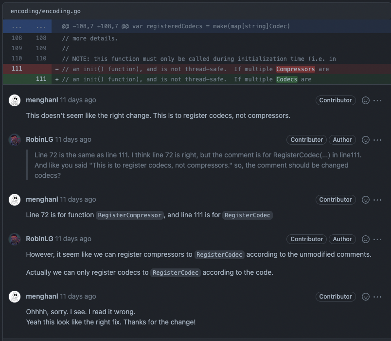
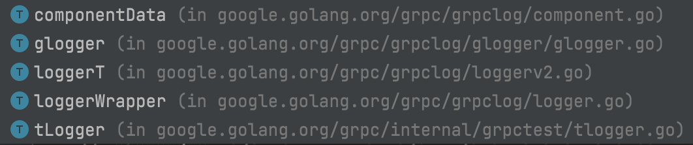
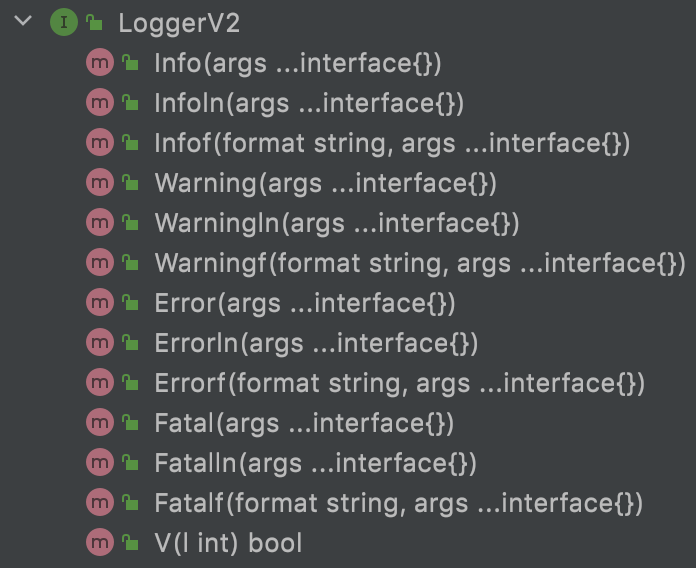
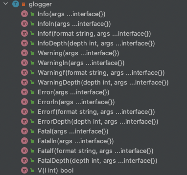
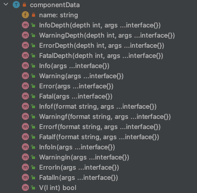
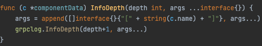
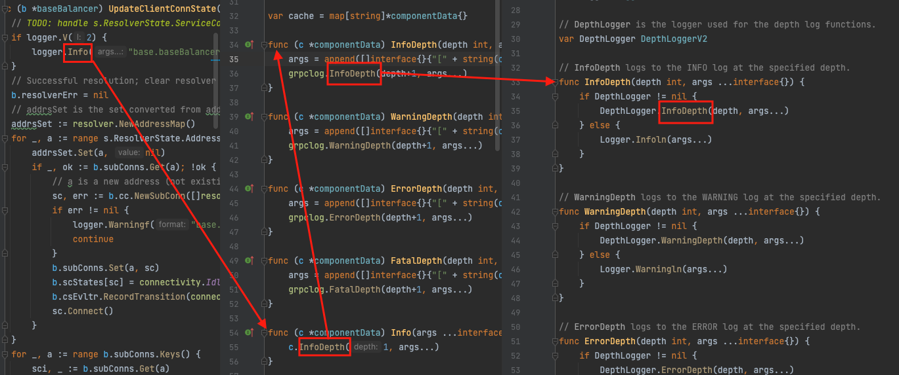
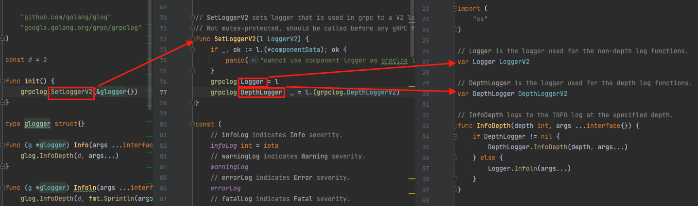
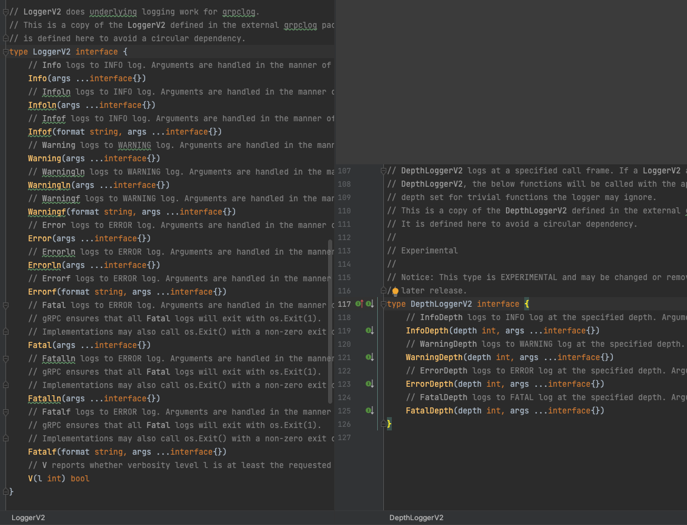
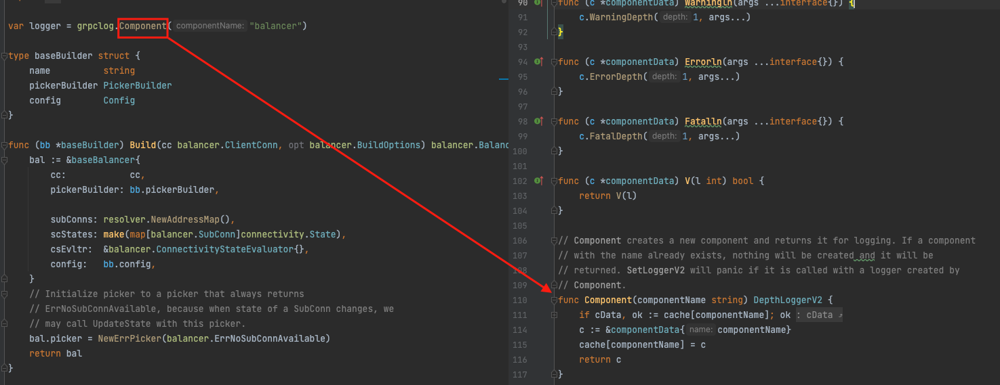

从上个月开始梳理grpc-go的源码，希望从中学习到一些来自谷歌“原汁原味”的代码设计及风格。第一个开始分析的包是**encoding**，这个包下的代码行数不多，主要就是如下两个部分

  * **encoding/decoding**
  * **compress/decompress**

**encoding/decoding**是直接使用了第三方的包「`<strong>protobuf</strong>`规范的Go实现」，笔者没有继续深入梳理第三方包的代码。

**compress/decompress**是使用了Go SDK的**compress**包，笔者也并没继续往官方包的方向看代码。

所以对于grpc-go的encoding这个包，grpc-go本身并没有自己实现编码/解码，压缩/解压缩的代码，而是调用其他包。所以这个包也没什么代码值得去分析。不过值得一提的是笔者在看这个包的注释时候发现了一个错误，后来提了PR，reviewer当时跟我争辩了几句（他认为没有错）。然而，最终我的PR还是被合并啦！

接下来进入正题，开始分析第二个包**grpclog**。在梳理这个包的过程中，恰巧我准备从0开始为一个开源项目贡献Go-SDK。截止文章分享时，这个Go-SDK的logger部分我已经编写完成，设计的风格几乎与grpc的logger无异。毕竟，学以是为了致用 😀

通过源码可以知道loggerWrapper已经弃用，loggerT和tLogger是为了单元测试和基准测试用的，所以本文暂不讨论这三种struct(为行文流畅易读，struct在后面统称结构体)。

因此下文主要从以下三点分析：

<ul class="has-black-color has-text-color">
  <li>
    glgger结构体
  </li>
  <li>
    componentData结构体
  </li>
  <li>
    初始化流程
  </li>
</ul>

#### **glogger**结构体 {.has-luminous-vivid-orange-color.has-text-color.wp-block-heading}

梳理所有grpc-go打印日志的方法（除了测试用的实现方法）会发现：尽管一些方法所属的结构体并不是glogger（一些是下面的componentData），但调用链最终还是会到glogger结构体所属的方法。最后，glogger结构体的方法使用了第三方包“glog”输出日志。

  glog是谷歌在github上开源的日志类项目

通过梳理这些结构体的实现方法，还能发现duck-typing这种设计思想在Go语言中的使用，深深体验到这种简洁的设计风格所带来的便利性。简单来说就是当一个结构体的实现了一个接口的所有方法，那么这个结构体就实现了这个接口。以grpc-go举例说明：

从下边的图可以看出glogger结构体实现了上边LoggerV2接口的所有方法，那么我们可以说glogger结构体实现了LoggerV2接口，而无需像Java一样在类后面显示地用implements声明。

#### **componentData结构体** {.has-luminous-vivid-orange-color.has-text-color.wp-block-heading}

首先，可以从**componentData**结构体实现的方法看出：它同样了**LoggerV2**接口，如下图：<figure class="wp-block-gallery columns-2 is-cropped wp-block-gallery-40 is-layout-flex">

以componentData结构体的InfoDepth方法举例，该方法作用主要有两点：

  1. 在每行日志前拼接调用该方法的微服务名称；
  2. 将指定的日志打印栈深度+1。<figure class="wp-block-image size-large">

实际上大部分微服务的都是通过调用Info方法（指定了日志打印栈深度为1），来调用InfoDepth：<figure class="wp-block-image size-large">

最后internal包里的方法会判断是否初始化了变量DepthLogger去执行真正输出日志的方法。至于变量DepthLogger是如何被初始化的，会在第三部分“初始化流程”中分析。先提前说明：这里被初始化进去的正是glogger结构体，所以最终由第三方包“glog”输出日志。

#### **初始化流程** {.has-luminous-vivid-orange-color.has-text-color.wp-block-heading}

这里会分析两个初始化流程：

  1. glogger结构体是如何被初始化？使其方法为grpc-go打印日志；
  2. 微服务的名称是如何被初始化？使前面的InfoDepth方法能获取其名称。

##### glogger结构体的初始化 {.has-luminous-vivid-orange-color.has-text-color.wp-block-heading}<figure class="wp-block-image size-large">

从图4可以看出以下几个细节：

  1. 图3中的Logger和DepthLogger正是由这里被初始化进去；
  2. componentData不可能会被初始化为grpc-go打印日志的结构体，如果初始化就会panic。况且componentData结构体本身的用意也只是拼接微服务名称进日志而已，这里防止componentData结构被错误使用；
  3. glogger既实现了LoggerV2接口，也实现了DepthLoggerV2接口。可以结合图1和下面的图5来看，因为glogger既实现了LoggerV2接口的所有方法，也实现了DepthLoggerV2接口的所有方法（这也是duck-typing思想）。

##### 微服务名称的初始化 {.has-luminous-vivid-orange-color.has-text-color.wp-block-heading}<figure class="wp-block-image size-large">

从图6可以看出：在初始化微服务下的logger变量时会调用Component方法，将微服务名赋予一个新建的componentData结构体，并返回该componentData结构体。在这过程中，这个新建的componentData结构体还被储存在了一个名为cache的map里，并以微服务名作为key。

#### 结论 {.has-vivid-red-color.has-text-color.wp-block-heading}

从上面的分析可以得出：在微服务里打印日志，调用的就是componentData结构体的方法。而componentData结构体的方法为每行要输出的日志前面拼接上了微服务的名称。然后调用glogger结构体的方法打印日志，最终由第三方包“glog”输出日志。（grpc-go version:1.47.0）