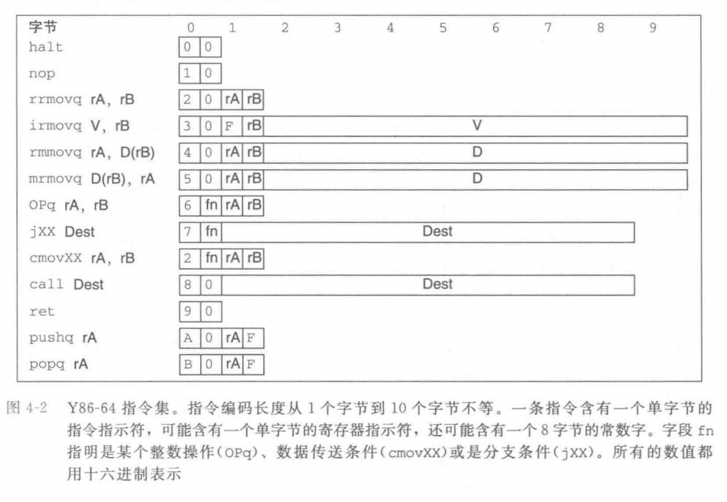
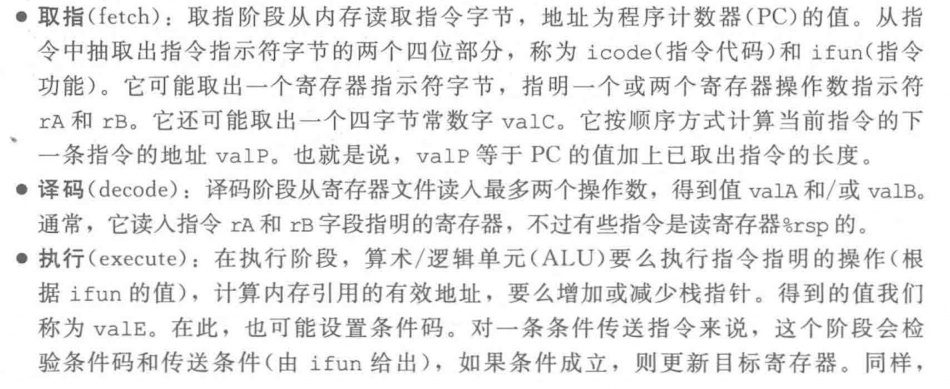

《深入理解计算机系统》第4节——处理器体系结构中定义了一个简单的指令集“Y86-64”，是以经典的“x86-64”指令集作为启发，简化了很多东西。以便更容易理解和入门相关知识。

以下简单概述本章节重点，更多详细资料可以从书中查阅。

### Y86-64指令集体系结构 {.wp-block-heading}

下图举例了Y86-64中定义的一些指令，简单来说就是对寄存器、内存中的数据进行操作。<figure class="wp-block-image size-full">

如果我们用Y86-64的编译器生成汇编代码，那么汇编代码里的指令集就会是上图那些。例如由GCC编译器产生的汇编代码，汇编代码里的指令就属于x86-64指令集。<figure class="wp-block-image size-full">

### HCL {.wp-block-heading}

HCL（Hardware Control Language，硬件控制语言），用这种语言来描述不同处理器设计的控制逻辑。

### Y86-64的顺序（SEQ，sequential）实现 {.wp-block-heading}

