本文为《深入理解计算机系统》— 「2.2 整数表示」章节的小结。

## 补码 {.wp-block-heading}

无符号数的编码

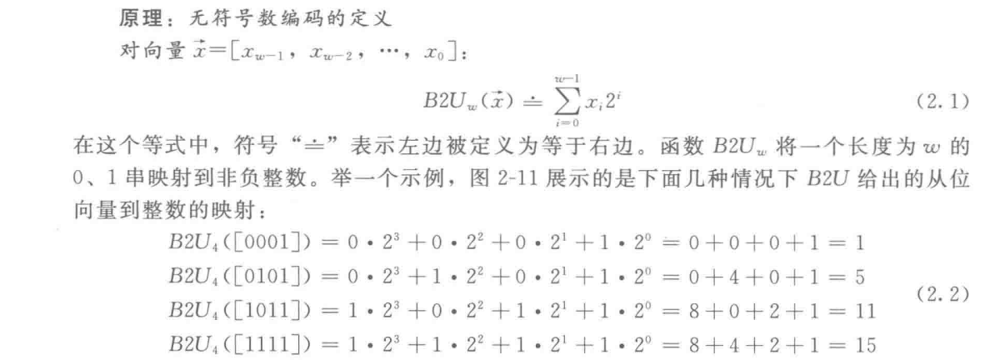

补码编码

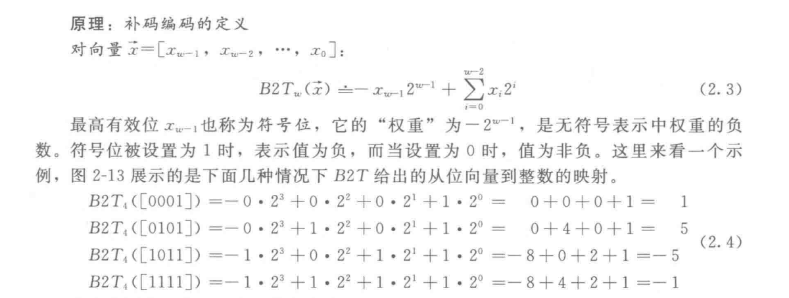

C语言标准并没有要求要用补码形式来表示有符号整数，但是几乎所有的机器都是这么做的。在补码(two&#8217;s -complement )的定义中，将字的最高有效位解释为负权(negative-weight)。

有符号数还有两种表示形式：反码(ones&#8217;-complement )和源码(sign-magnitude)。

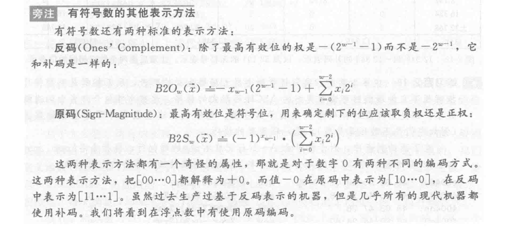

## 有符号数和无符号数之间的转换 {.wp-block-heading}

补码转换为无符号数

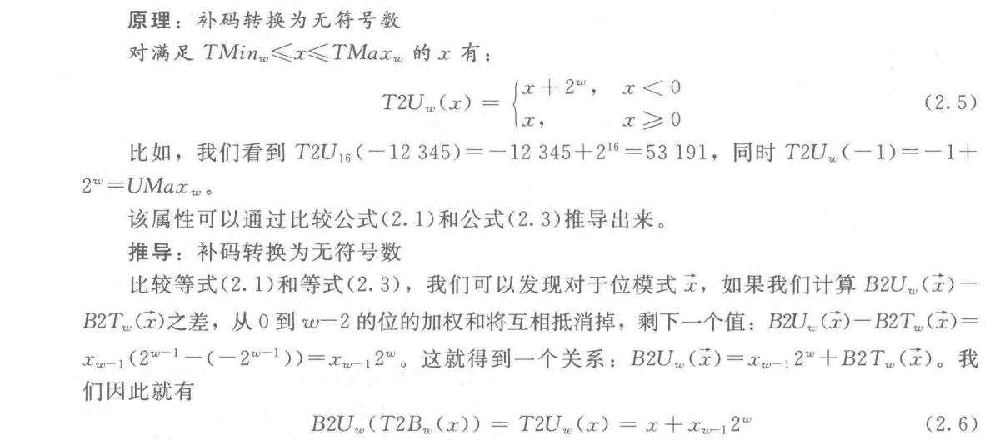

无符号数转换为补码

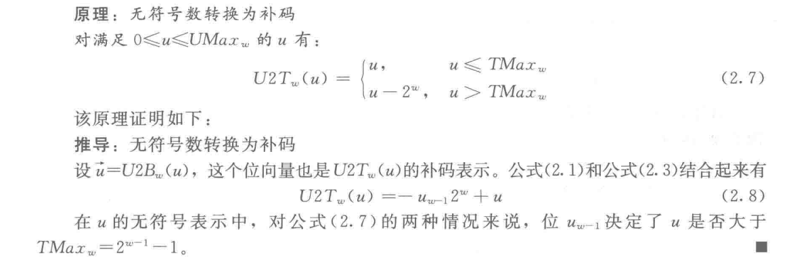

在C语言中对同时包含有符号和无符号数表达式的处理时，有需要注意的地方：

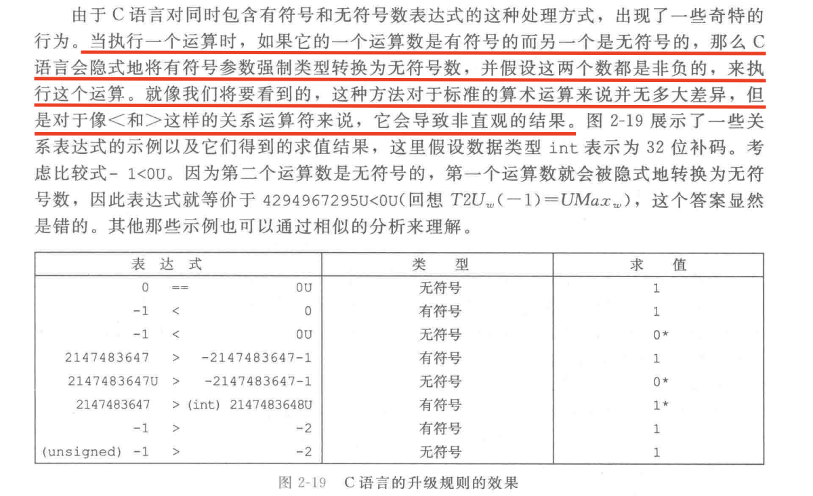

Go语言就避免了这个可能会犯错的地方。因为Go语言在对同时包含有符号数和无符号数表达式的处理时，不会进行隐式强制转换，需要我们自己进行强制转换。

## 扩展数字 {.wp-block-heading}

无符号数的扩展

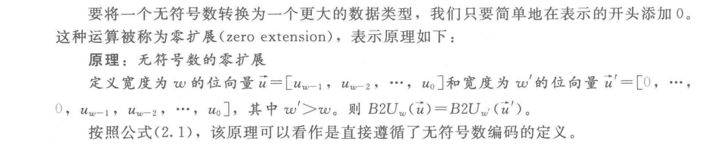

补码数的符号扩展(扩展的位等于补码的最高有效位)

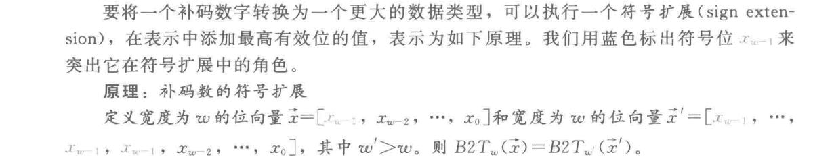

## 截取数字 {.wp-block-heading}

截取无符号数

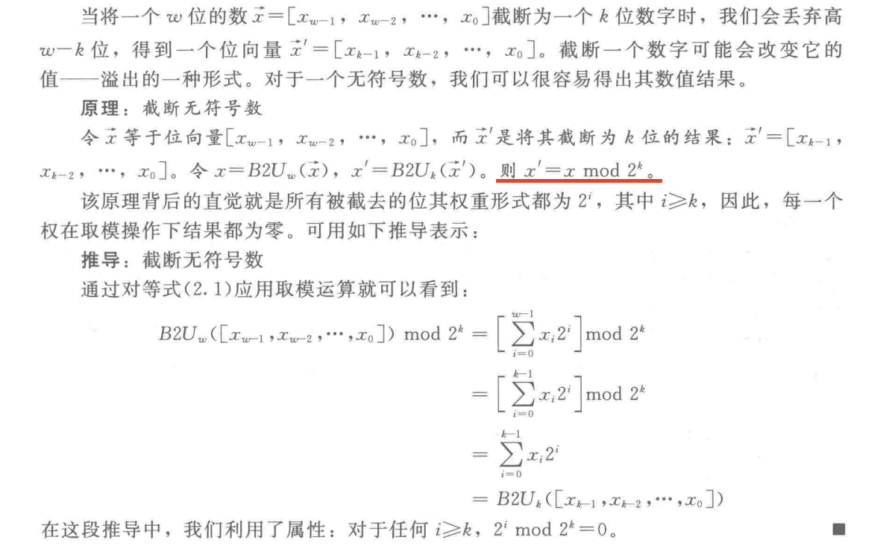

截取补码数值

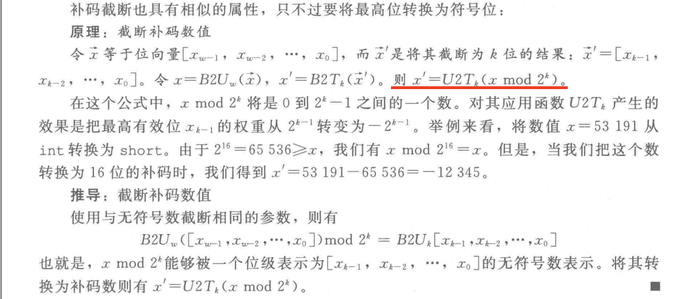

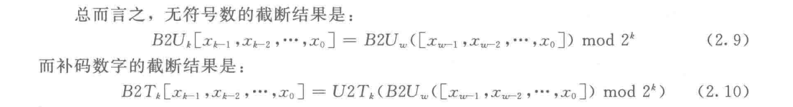

**参考资料**

《深入理解计算机系统第三版》