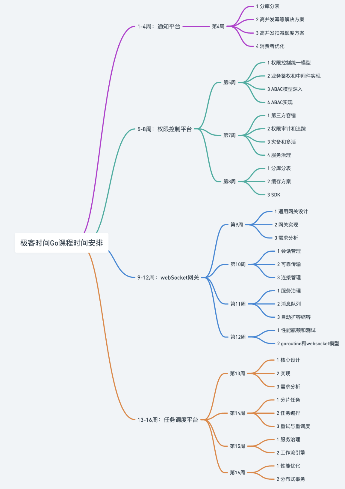
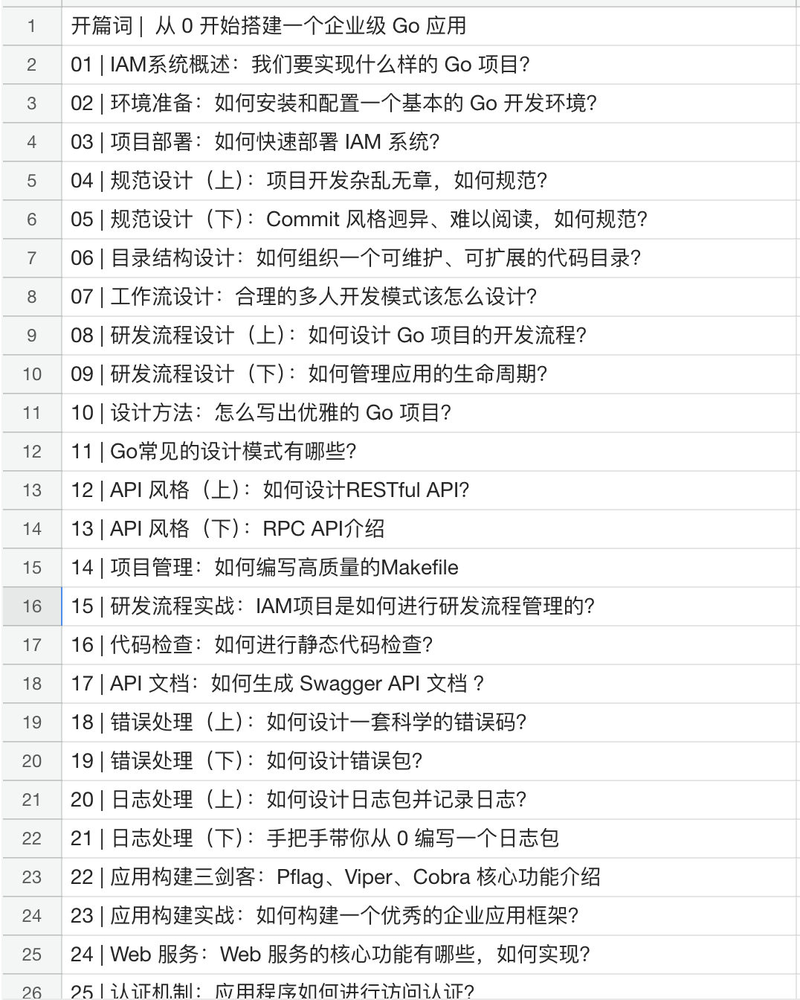
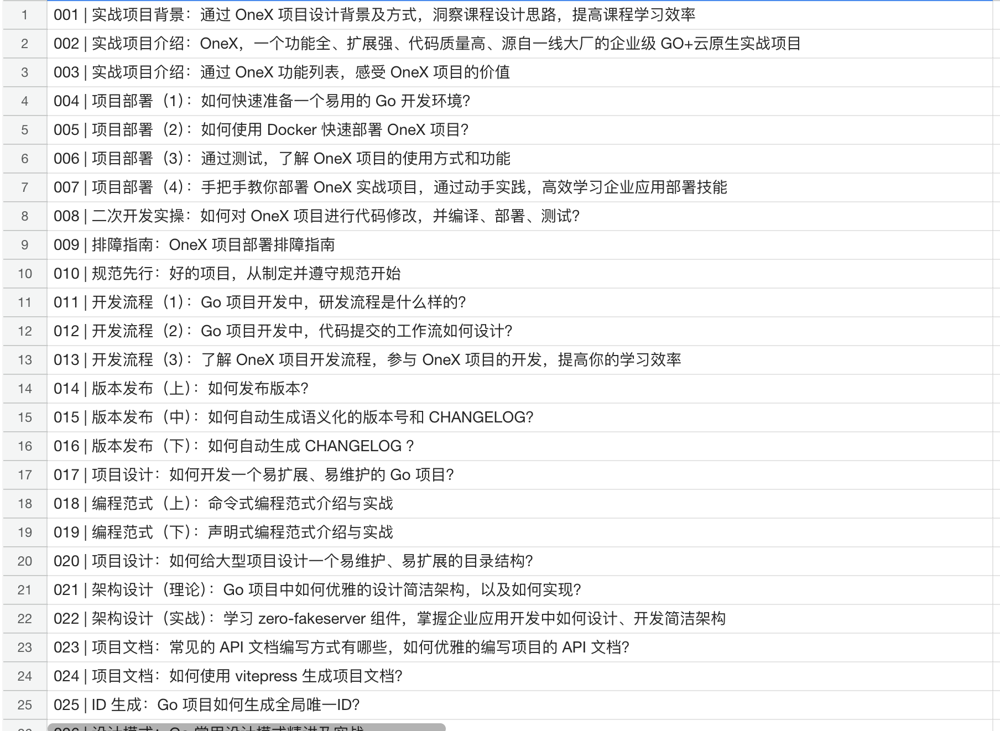

## 我提问
对比我给的两个课程大纲（第一张是极客时间的课程A，后面两张是孔老师的课程B），如何做选择？


  
  
  


## AI回答
好的，非常清楚。第一张图是课程A（极客时间-项目实战驱动），第二、三张图是课程B（看起来是孔老师或白海飞老师的IAM项目驱动课程）。

基于你提供的详细大纲，我现在可以为你做一个非常具体和深入的对比分析，帮助你做出选择。

### 核心结论先行

这两个课程定位有显著差异，适合不同阶段和不同目标的学习者：

*   **课程A（极客时间）： 更偏向“架构师”和“高并发/分布式系统构建”。** 它的目标是带你从零开始搭建几个中型分布式系统，重点解决高并发场景下的各类技术难题。
*   **课程B（IAM/OneX项目）： 更偏向“高级工程师”和“工程化/项目质量”。** 它的目标是深入一个大型项目（IAM），教你如何把一个Go项目写得更规范、更健壮、更易维护，覆盖完整的研发生命周期。

简单粗暴的选择建议：
*   **如果你想攻坚“高并发、分布式核心系统”（如网关、调度平台），希望简历上有亮眼的分布式项目经验，选课程A。**
*   **如果你想系统提升“代码规范、工程化、架构可维护性、项目全流程管理”，希望成为团队的技术骨干，写出企业级的高质量代码，选课程B。**

---

### 详细维度对比分析

我们将使用刚才提到的几个纬度进行对比：

#### 1. 内容深度与侧重点（最关键的差异）

| 特性 | 课程A（极客时间） | 课程B（IAM/OneX项目） | 分析 |
| :--- | :--- | :--- | :--- |
| **核心特点** | **横向广度、分布式专题** | **纵向深度、工程化专题** | A课通过4个不同项目覆盖不同技术面；B课通过1个大项目深挖所有工程细节。 |
| **技术焦点** | **高并发、分布式解决方案**：分库分表、WebSocket网关、任务调度、服务治理、自动扩缩容、分布式事务。 | **软件工程最佳实践**：规范设计（代码、Commit、目录）、研发流程、错误/日志处理、SDK设计、认证授权模型、测试、部署、安全。 | A课更关注系统层面的规模扩展和性能；B课更关注代码层面的质量和团队协作效率。 |
| **项目类型** | 通知平台、权限平台、WebSocket网关、任务调度平台（4个独立的微服务/系统）。 | 一个统一的IAM（身份识别与访问管理）系统，并扩展Web应用、微服务等。 | A课的项目经验更“散”，但见识更广；B课的项目经验更“深”，更能体现对复杂业务系统的掌控能力。 |
| **高级主题** | 涉及了**分布式事务**、**自动扩缩容**等非常高级的主题。 | 涉及了**简洁架构设计**、**声明式编程**等高级设计思想。 | 两者都有硬核内容，但方向不同。A课偏重分布式算法和架构；B课偏重架构模式和设计哲学。 |

#### 2. 讲师背景与口碑（基于内容推断）

*   **课程A**：从大纲看，讲师必须有丰富的**分布式系统一线实战经验**，能够设计并扛住高并发场景。这类讲师通常来自大型互联网公司的基础架构或核心业务部门。
*   **课程B**：从大纲看，讲师必须是**代码洁癖**和**流程优化专家**，对软件工程有极深的理解。这类讲师通常是团队中的Tech Lead或架构师，非常注重规范和最佳实践。

**行动建议**：你需要去这两个课程的介绍页面，核实讲师的具体背景，看谁的经历更吸引你，更符合你的职业偶像路径。

#### 3. 教学形式与实践性

| 特性 | 课程A（极客时间） | 课程B（IAM/OneX项目） | 分析 |
| :--- | :--- | :--- | :--- |
| **实践方式** | **项目驱动**，每个阶段实现一个可运行的平台/网关。 | **同样项目驱动**，但围绕一个核心项目（IAM）不断添加特性和优化。 | 都是强实践性课程。A课像连续做几个课程设计；B课像参与一个大型开源项目的持续开发。 |
| **亮点** | 项目场景典型且有一定难度（如网关、调度），做完成就感强，适合充实简历。 | **极其全面**，从写代码的第一行（规范）到最终部署上线（容器化、K8s）全部涵盖，能培养完整的工程化思维。 | B课在“研发流程”、“规范”等方面的实践是独一无二的，这是很多课程忽略的软实力。 |

#### 4. 与你当前水平的匹配度

这是你需要问自己的问题：

*   **你的薄弱点是什么？**
    *   如果是对**分布式理论**理解不深，缺乏**高并发项目**经验，看到“分库分表”、“服务治理”就发怵，那么**课程A**更适合你。
    *   如果是对**如何组织大型项目**、**如何保证代码质量**、**如何与团队高效协作**感到困惑，想系统学习企业级的开发流程和规范，那么**课程B**无疑是更好的选择。

*   **你的职业目标是什么？**
    *   想往后端架构师、基础设施工程师方向发展，专注于解决性能瓶颈和系统扩展性问题？ -> 偏向 **课程A**。
    *   想往技术专家、Tech Lead、首席工程师（CTO）方向发展，负责搭建团队技术体系、保证项目交付质量？ -> 偏向 **课程B**。

### 总结与最终建议

为了更直观，我们做一个评分卡（5分制）：

| 评估纬度 | 课程A（极客时间） | 课程B（IAM/OneX项目） | 胜出方 |
| :--- | :--- | :--- | :--- |
| **分布式/高并发深度** | ⭐⭐⭐⭐⭐ (5) | ⭐⭐⭐ (3) | **课程A** |
| **软件工程/规范深度** | ⭐⭐ (2) | ⭐⭐⭐⭐⭐ (5) | **课程B** |
| **技术广度（覆盖主题）** | ⭐⭐⭐⭐ (4) | ⭐⭐⭐⭐⭐ (5) | **课程B** |
| **项目实战性** | ⭐⭐⭐⭐ (4) | ⭐⭐⭐⭐⭐ (5) | **课程B** |
| **对简历的助力** | **亮点突出**（有网关、调度等项目） | **基础扎实**（展示极强的工程能力） | **平手** |

**最终决策指南：**

1.  **补短板**：明确你当前最需要弥补的知识缺口是哪个方向。
2.  **看未来**：思考你下一份工作或未来1-2年想达到的技术目标。
3.  **试听体验**：**务必去试听两者的前几节课！** 感受讲师的表达风格和节奏，看哪个更能让你学下去。

这两个都是非常优秀的进阶课程，没有绝对的好坏，只有是否适合你。希望这个详细的对比能帮助你做出不后悔的选择！