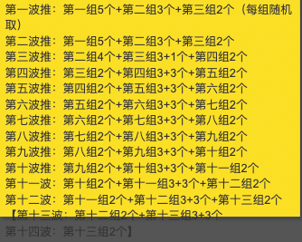
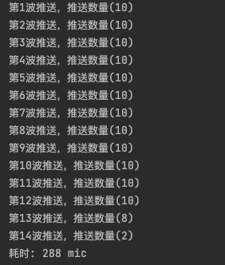

## <span class="ez-toc-section" id="%E8%83%8C%E6%99%AF"></span>背景<span class="ez-toc-section-end"></span> {.wp-block-heading}

业务需求：主播和用户可进行按时收费的1对1语音聊天。

参与开发人数：3

个人角色：非核心开发（B角），负责随机匹配主播和分成。

## <span class="ez-toc-section" id="%E9%9A%BE%E7%82%B9"></span>难点<span class="ez-toc-section-end"></span> {.wp-block-heading}

<ol start="1">
  <li>
    推荐算法，算法要求：按分数从高到低排序，推送&nbsp;x&nbsp;组，每组&nbsp;y&nbsp;人，每次推三组（每组推送比例&nbsp;a&nbsp;:&nbsp;b&nbsp;:&nbsp;c），x,&nbsp;y,&nbsp;a,&nbsp;b,&nbsp;c均可配置（其中要求a+b+c=100%，a>b>c，y必须为10的整数倍，x为整数）。每次推送人数等于：没被推完的前三组乘以每组推送比例，若前一组的推送人数不足，则由后一组补足，直至每组人都被推完。以配置推送13组，每组10人，每组推送比例50%:30%:20%为例，推送情况如下图：
  </li>
</ol>



<ol start="2">
  <li>
    在开始随机匹配时，需要筛选出所有符合条件的主播。如何避免瞬时产生大量查询请求（主要是一些耗时高的RPC接口）。
  </li>
</ol>

## <span class="ez-toc-section" id="%E8%A7%A3%E5%86%B3%E6%96%B9%E6%A1%88"></span>解决方案<span class="ez-toc-section-end"></span> {.wp-block-heading}

算法的示例代码（Go）如下：

```go
type AnchorMatchingScore struct {
	AnchorID int64 // 主播ID
	Score int64 // 分数
}

// TestPushAnchorAlgorithm 测试推送算法
func TestPushAnchorAlgorithm(t *testing.T) {
    start := time.Now()

	// 生成模拟数据(130个人)：`totalPeople`个人的ID和分值随机生成，ID在0-2000000，分数在0~999之间
    var (
        totalPeople = 130
	     peoples = make([]*AnchorMatchingScore, totalPeople)
    )
	rand.Seed(time.Now().UnixNano())
	for i := 0; i &lt; totalPeople; i++ {
		peoples[i] = &AnchorMatchingScore{AnchorID: rand.Int63n(2000000), Score: rand.Int63n(1000)}
	}

    // 按分数排序
	sort.Slice(peoples, func(i, j int) bool {
		return peoples[i].Score &gt; peoples[j].Score
	})

    // 按照分值从高到低排序，并将其分为每`groupPeople`个一组
	var (
		groupPeople = 10
		totalGroup  = 0
	)
	if totalPeople%groupPeople == 0 {
		totalGroup = totalPeople / groupPeople
	} else {
		totalGroup = totalPeople/groupPeople + 1
	}
	groups := make([][]*AnchorMatchingScore, totalGroup)
	for i := 0; i &lt; totalGroup; i++ {
		groups[i] = make([]*AnchorMatchingScore, 0, groupPeople)
	}
	for i, people := range peoples {
		groups[i/groupPeople] = append(groups[i/groupPeople], people)
	}

    // 每组推送人数
	pushNumInGroup := []int{int(float32(groupPeople) * 0.5), int(float32(groupPeople) * 0.3), int(float32(groupPeople) * 0.2)}

    countx := 1
	// 推送人员循环，直到所有人员都被推送
	for len(peoples) &gt; 0 {
		// 计算本次推送需要从哪些组中选取人员
		var selectedGroups []int
		selectedGroups = append(selectedGroups, 0, 1, 2)

		// 从选定的组中随机选择人员，并将其从原数组中删除
		var selectedPeoples []*entity.AnchorMatchingScore
		for _, groupIndex := range selectedGroups {
			if len(groups)-1 &lt; groupIndex {
				break
			}
			group := groups[groupIndex]
			var count int
			switch groupIndex {
			case 0:
				if len(group) &gt;= pushNumInGroup[0] {
					count = pushNumInGroup[0]
				} else {
					count = len(group)
				}
			case 1:
				count = pushNumInGroup[0] - len(selectedPeoples) + pushNumInGroup[1]
			case 2:
				count = groupPeople - len(selectedPeoples)
			}
			for i := 0; i &lt; count && len(group) &gt; 0; i++ {
				index := rand.Intn(len(group))
				selectedPeoples = append(selectedPeoples, group[index])
				group = append(group[:index], group[index+1:]...)
			}
			groups[groupIndex] = group
		}

		// 输出本次推送的结果
		println(fmt.Sprintf("第%d波推送，推送数量(%d)", countx,  len(selectedPeoples)))
		countx++

		// 从"总人数数组"中删除已经选定的人员，并更新各组的数据
		for _, selectedPeople := range selectedPeoples {
			for i, s := range peoples {
				if s == selectedPeople {
					// 删除已经选定的人
					copy(peoples[i:], peoples[i+1:])
					peoples[len(peoples)-1] = &AnchorMatchingScore{}
					peoples = peoples[:len(peoples)-1]
					break
				}
			}
		}
		for i, group := range groups {
			for j, people := range group {
				if people == nil || !containsAnchor(peoples[:], people) {
					// 如果组里的人员已经不在"总人数数组"中，则在组里置空该人员
					groups[i][j] = &entity.AnchorMatchingScore{}
				}
			}
			// 将组里的人重新按分数排序
			sort.Slice(group, func(i, j int) bool {
				return group[i].Score &gt; group[j].Score
			})
			groups[i] = group
		}

		// 如果第一组已经没人，则删除该组
		if len(groups[0]) == 0 {
			copy(groups[0:], groups[1:])
			groups[len(groups)-1] = []*entity.AnchorMatchingScore{}
			groups = groups[:len(groups)-1]
		}

		// 兜底
		if totalGroup*2 &lt; countx {
			break
		}
	}

	println(fmt.Sprintf("耗时: %d mic", time.Now().Sub(start).Microseconds()))
}

// containsAnchor 是否包含主播
func containsAnchor(list []*AnchorMatchingScore, anchor *AnchorMatchingScore) bool {
	for _, v := range list {
		if v.AnchorID == anchor.AnchorID {
			return true
		}
	}
	return false
}
```

运算结果如下：



<ol start="2">
  <li>
    由于线上存在大量主播，避免瞬时调用大量接口，可以根据实际情况将耗时高的接口放在“心跳”接口里进行查询，并将查询结果数据另外存储在Redis或DB中。在随机匹配发起时，直接根据这份数据进行判断，做过滤即可。
  </li>
</ol>

## <span class="ez-toc-section" id="%E6%94%B6%E8%8E%B7"></span>收获<span class="ez-toc-section-end"></span> {.wp-block-heading}

<ol start="1">
  <li>
    拓宽了推荐算法解决思路；
  </li>
  <li>
    拓宽了避免瞬时产生大量查询请求的思路。
  </li>
</ol>