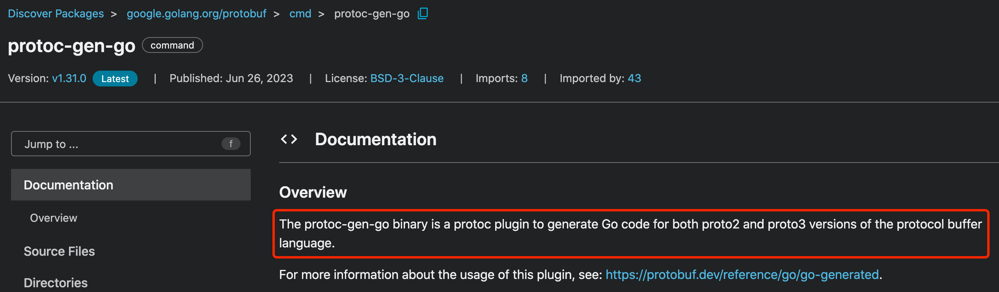
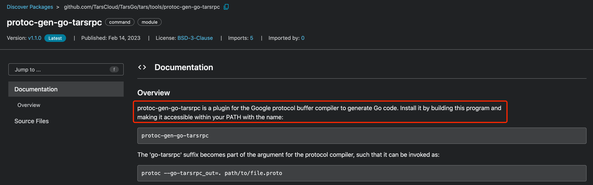

## 框架介绍 {.wp-block-heading}

我们项目使用的微服务框架是腾讯开源的Tars，关于框架更多的资料请查阅[官网][1]。

## RPC协议 {.wp-block-heading}

RPC协议使用谷歌的[Protocol Buffers][2]。

## 业务开发环境安装 {.wp-block-heading}

需要注意的是，在开发环境安装以下依赖之前。你应该已经根据Tars的官方文档安装好了[Tars框架][3]。

由于我们业务开发的编程语言是Golang，所以还需要安装另外的一些插件。所需的依赖如下：

  * protoc
  * protoc\_gen\_go
  * protoc\_gen\_tarsgo
  * git-lfs（可选）

### protoc {.wp-block-heading}

该可执行文件将RPC接口的定义描述文件（*.proto），编译为指定编程语言的实现代码（C++, Java&#8230;）。可以从官方的[Github][4]上下载protoc并加入到本机的环境变量中，如~/.bash_profile。

### protoc-gen-go {.wp-block-heading}

protoc的插件，因为protoc原生没有支持生成Golang实现代码，所以需要通过安装此插件生成Golang实现代码（文件后缀：*.pb.go）。

go package官方文档的[描述][5]：

### protoc-gen-go-tarsrpc {.wp-block-heading}

Tars也支持通过Protocol Buffers生成RPC调用接口（文件后缀：*_tars.pb.go），但也是需要安装此插件。

go package官方文档的[描述][6]：<figure class="wp-block-image size-large">

### git-lfs {.wp-block-heading}

Large File Storage (LFS) 。他是git对大文件存储的一种方案实现，详情参阅[官方][7]介绍。

## 在Tars里使用Protocol Buffers {.wp-block-heading}

可以在我[Github][8]下载这个DEMO，下面说一下生成协议的方式。

<pre class="wp-block-code"><code lang="bash" class="language-bash"># 进入DEMO的一级目录下
cd  ~/Workspace/golang/src/github.com/TarsExample

# 执行编译协议的脚本
sh ./build_protocol.sh</code></pre>

执行完以上两个命令后，就可以看到server/pb下生成了`helloworld.pb.go`和`helloworld_tars.pb.go`两个文件。

其中`helloworld.pb.go`是由protoc-gen-go生成，`helloworld_tars.pb.go`是由protoc-gen-go_tarsrpc生成。从生成的两个文件可以看出`helloworld_tars.pb.go`里面引用了`helloworld.pb.go`的内容。

这就是在Tars里面使用Protocol Buffers的方式。至此，Tars已经用Golang为我们实现并生成了在Protocol Buffers文件里定义的接口。

 [1]: https://tarscloud.org
 [2]: https://protobuf.dev
 [3]: https://doc.tarsyun.com/#//installation/README.md
 [4]: https://github.com/protocolbuffers/protobuf/releases
 [5]: https://pkg.go.dev/google.golang.org/protobuf/cmd/protoc-gen-go
 [6]: https://pkg.go.dev/github.com/TarsCloud/TarsGo/tars/tools/protoc-gen-go-tarsrpc
 [7]: https://git-lfs.com
 [8]: https://github.com/RobinLG/TarsExample