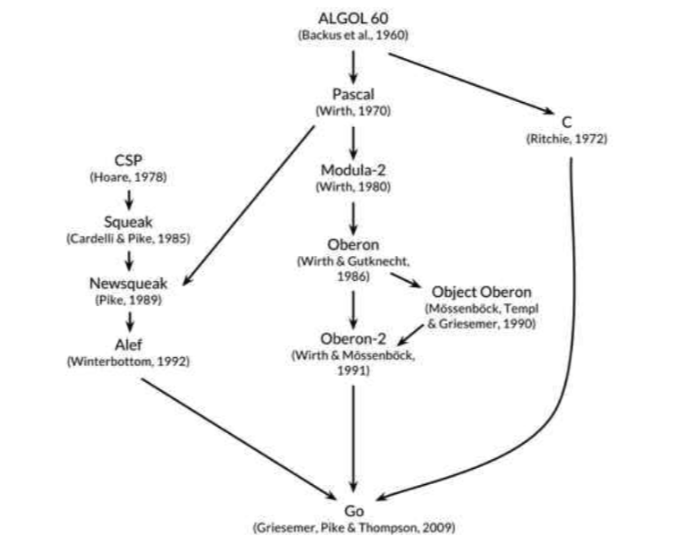

在今年春节结束之际，给自己订了学习计划：包括阅读一些书籍和在线课程，其目的是为了提高Go的技术水平。昨天，学习进度到了这项计划的里程碑——50%，而我毅然决然地放弃了之前的计划，花了约一天的时间说服自己制定新的计划并开启一段新的学习之旅。

文章接下来的内容会记录昨天思想斗争的片段，供未来回首。若对正在阅读此篇文章的你有帮助/启发，那真是笔者莫大的荣幸。若跟你的观点相悖，忽略以下内容即可。

从Java工程师转到Go工程师已经过去五个月（对于非程序员读者可以这样理解：从英语翻译员转到法语翻译员），现在笔者自认为处在初/中Go工程师的水平。如果按照之前订下的计划继续学习，再花几个月的时间也仅是横向扩展了知识面，对于Go语言的深度认知还会是欠缺的状态，这跟我想达到的目标不一致。

笔者不想再踩下以前学习Java的坑：“对于一个编程语言本身的设计思想，官方标准库的方法以及其它等等基础知识还没熟练掌握，就开始学习各种框架，第三方中间件的使用“。这虽然有益于快速上手企业的业务代码开发，可无益于做一个编程风格优秀的程序员，也很难在各大论坛/社区与其他优秀的程序员“对线”。

“愿意花时间横向扩展，而不愿意花时间纵向深究知识“这种现象的产生我认为一部分来自于各大企业的招聘需求，希望求职者什么技能都掌握。其实能猜到企业会将愿意将大部分投入放到招聘业务开发的程序员，毕竟业务开发直接与收入挂钩。现在还真没有勇气在简历上用“精通A”替换“掌握A, B, C”，因为在各招聘网站上发布的职位还是以业务开发的多，负责框架/中间件/容器等这类专项研发的职位相对少些。

也许很多人（至少我以前就是）就会用这些招聘需求来决定自己的学习方向，花了很多精力做知识面的横向扩展，希望在和别人聊到某项技术的时候，自己多多少少能接得上话题。这也为接下来我要聊的内容做个铺垫：

  * “面向企业编程”还是“面向兴趣编程”
  * 目标
  * 做好自己的兴趣，总会有欣赏你的人/企业？
  * 自己的未来应该由自己决定

##### “面向企业编程“还是“面向兴趣编程” {.wp-block-heading}

这个问题放在三年前刚毕业的时候，毫无疑问我会选择“面向企业编程”，因为当时还不明确自己的目标。说实话，我现在选择“面向兴趣编程”还是会有一丝担心，毕竟当大部分人还是选择“面向企业编程”，对于那些在人潮中逆行的人来说应该都会有怀疑自己的时候。

企业的职位需求可以作为参考之一，但不应该为你的学习/发展方向做决定。这是我现在践行的学习/发展方式，至于我的选择是不是最优解，就留给时间来证明吧。

##### 目标 {.wp-block-heading}

人的时间都是有限的，所以得根据目标对时间进行取舍。如果你的目标是成为首富，那可能要将更多的时间留给赚钱；如果你的目标是成为大多数企业都青睐的对象，那可能要将更多的时间花在学习企业的需求。

对于完成我自己的目标，可以允许我把更多的时间放在我的兴趣上（我的兴趣现在就是精通Go，包括设计思想，标准库方法等）。我认为在IT行业中，细分到某一专业领域，如果你对这一领域很感兴趣，只要你的水平在第一梯队中。我觉得收入也不会比其他热门专业领域少很多，至少应该能过上相对自在的生活。虽然收入相对没那么多，但是过得自在、快活。

显然，我不是要做赚最多钱的程序员，是想做个喜欢编程的程序员。

##### 做好自己的兴趣，总会有欣赏你的人/企业？ {.wp-block-heading}

其实这个小标题我的答案也不确定，但很多文章/故事给出来的答案总是积极的。我想，在IT行业中，做好自己的兴趣，应该不会失业，即使失业也不会为一日三餐发愁吧？

##### 自己的未来应该由自己决定 {.wp-block-heading}

现在有很多IT行业的大佬为分享自己的经历，不妨一看，但无法也不能照抄。可以作为参考，然后制定一个自己的目标和一份成长规划。即便以后没能实现自己的目标，也不会埋怨自己照抄了别人的人生规划。: -D 其实我觉得，只要是一个态度积极的人并且认真的做了分析和计划，即便没实现目标，也不会差到哪里去。

最后，分享一下我新的学习之旅将从《The Go Programming Language》开始，这本书有中文版，但我想顺便提升我的英文阅读水平，就直接从原版读起了。如果各位读者是在读不下英文版，建议直接从中文版开始阅读。

书在一开始简单介绍了Go的起源，我下面引用原文大致的说一下。Go的发源主要如图所示的三处：C, Pascal, CSP

<blockquote class="wp-block-quote">
  

    Go is sometimes described as a “C-like language,” or as “C for the 21st century.” From C, Go inherited its expression syntax, control-flow statements, basic data types, call-by-value parameter passing, pointers, and above all, C’s emphasis on programs that compile to efficient machine code and cooperate naturally with the abstractions of current operating systems.
  

</blockquote>

C：语法表达式，控制流语句，基本的数据类型，值传递，指针这些都是从C语言继承过来。意在编译后的机器码可以更高效、自然地在操作系统上运行。

<blockquote class="wp-block-quote">
  

    But there are other ancestors in Go’s family tree. One major stream of influence comes from languages by Niklaus Wirth, beginning with Pascal. Modula-2 inspired the package concept. Oberon eliminated the distinction between module interface files and module implementation files. Oberon-2 influenced the syntax for packages, imports, and declarations, and Object Oberon provided the syntax for method declarations.
  

</blockquote>

Pascal族：模块的接口和实现，包的导入和声明方式

<blockquote class="wp-block-quote">
  

    Another lineage among Go’s ancestors, and one that makes Go distinctive among recent programming languages, is a sequence of little-known research languages developed at Bell Labs, all inspired by the concept of communicating sequential processes (CSP) from Tony Hoare’s seminal 1978 paper on the foundations of concurrency. In CSP, a program is a parallel composition of processes that have no shared state; the processes communicate and synchronize using channels. But Hoare’s CSP was a formal language for describing the fundamental concepts of concurrency, not a programming language for writing executable programs.
  

</blockquote>

CSP族：主要就是channel

书中还有些段落大致介绍了垃圾收集等其他特性的来源，还有像slices这种Go自己独创的特性。跟详细的内容可以查看书中的原文。