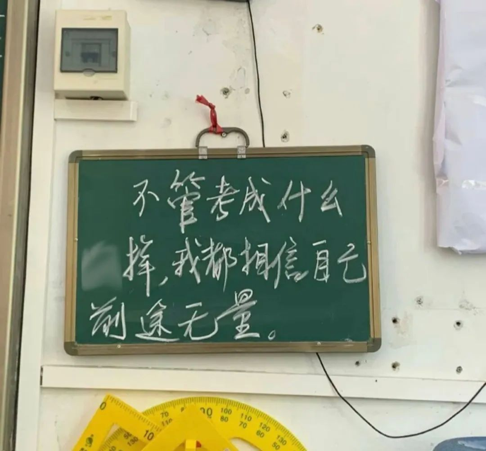
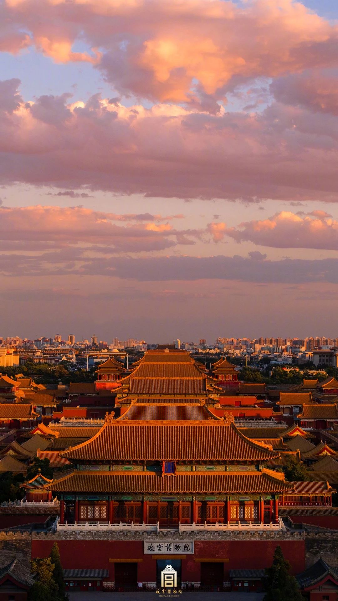

<blockquote class="wp-block-quote">
  

    最近看到一篇推文，想截取部分片段分享给大家。
  

  
  <cite>取自广东共青团公众号之《这个夏天，还有比吃冰西瓜更快乐的事情吗？》</cite>
</blockquote>

  <strong>在夏天，愿你的名字出现在心仪录取通知书上</strong>

这两天开始出高考成绩了——

💐 **如果所愿，这束花做贺礼，记住此刻的雀跃，也记得这份特别的”成人礼“：是你自己，曾努力付出，让一切皆有可能。**

🌟 **如果曲折，这颗星送你，别怕迷路，别放弃，在曲折的沿途会看到更多不一样的风景，你会比以前更懂自己最想要的是什么。**

无论如何，少年，听闻你的名字，当与平庸相斥。

  <strong>在夏天，邂逅一场会教会你很多的晚霞</strong>

**那是一个拼尽全力想要“抓住”的夏天。**

想要抓住知识点，想要抓住机会，想要抓住青春，想要抓住那个人的心，想要抓住更好的生活，想要抓住未来。

这时，晚霞，没有预告，以命中注定的桥段，携着似火如金的壮丽，走进似水年华的某个黄昏。**无声地盛大，却足够治愈。**

**给过去一点慰藉，给此刻一个深呼吸，再给未来一抹信心，深信：在自己的宇宙，一步一个脚印，踏实地坚定地走下去，就总会邂逅美好。**

**身披霞光，唯愿你的生命里也有足够多的云翳，来促成一场壮美绝伦的晚霞。**

  <strong>在夏天，又一次爱上夏天</strong>

“所有时间都是对夏天的加减。“不在夏天的日子里，等夏天到来，在夏天的日子里，细数夏天的好。

我想我是喜欢夏天的。

橘色的晚霞、冰镇的汽水和最甜的第一口西瓜&#8230;&#8230;说起夏天，每个人都有着不一样的回忆。

这里还有一些发生在夏天的故事，愿你带着这份美好和期待，拥抱每一段人生旅程。