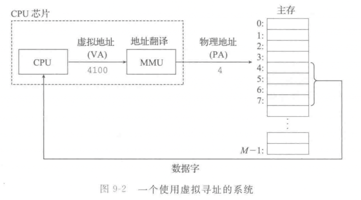
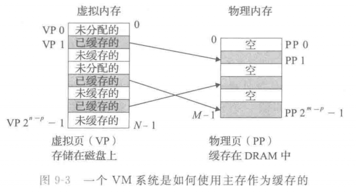
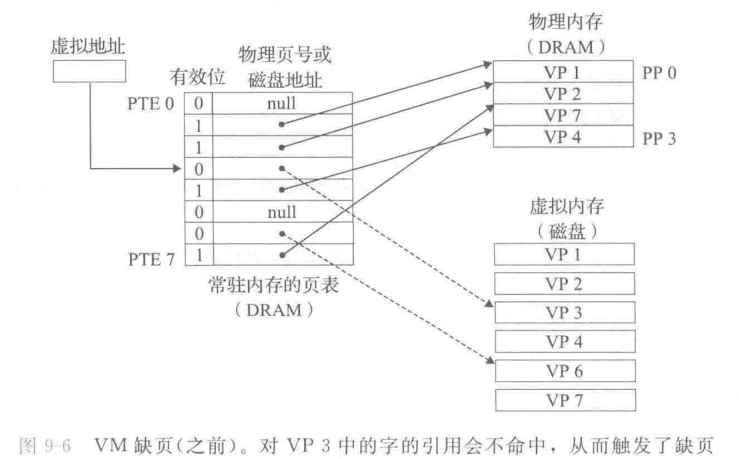
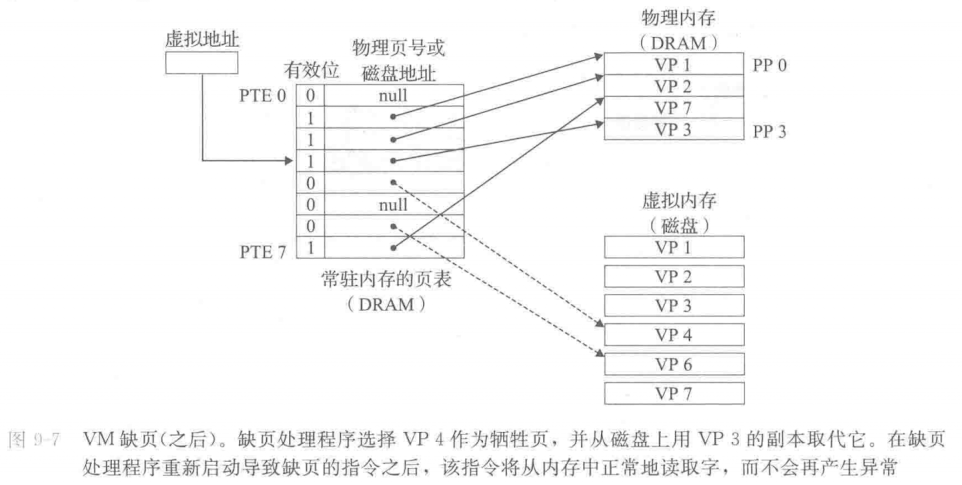
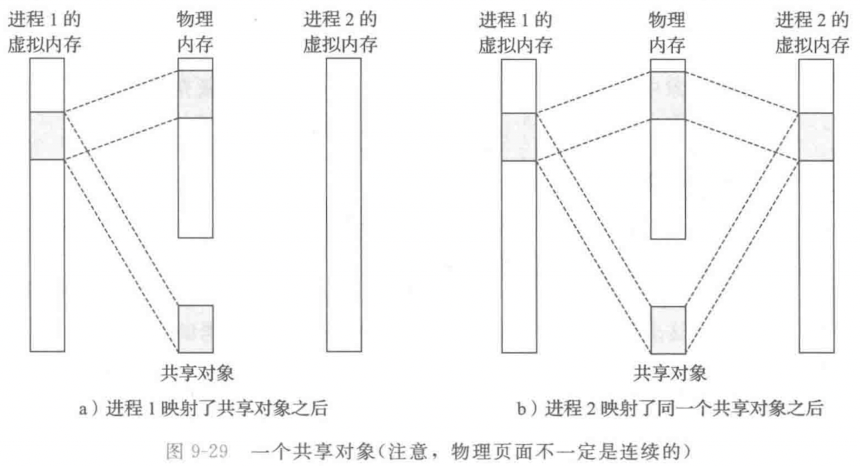
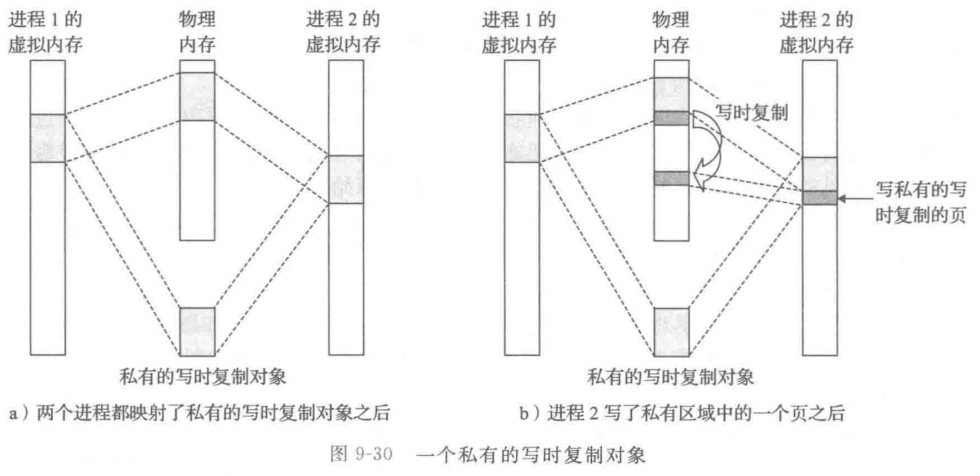
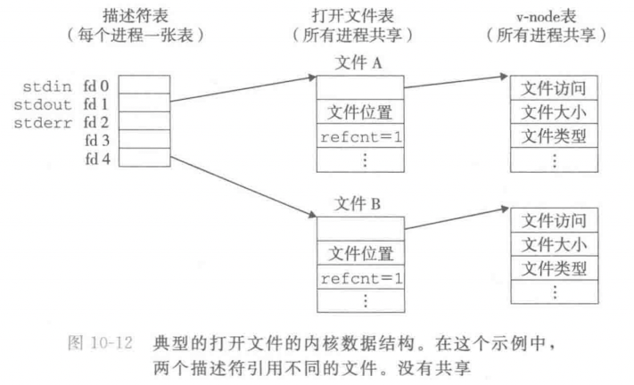
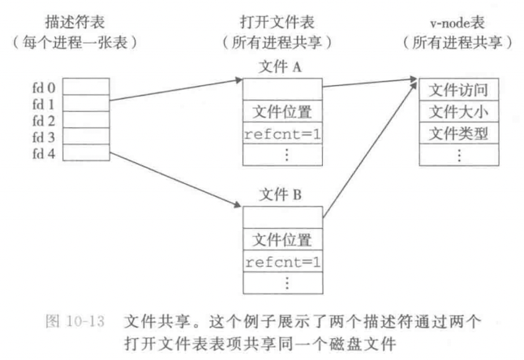
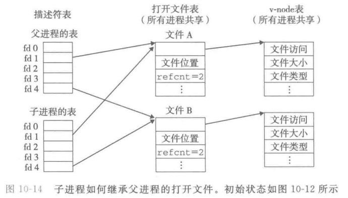

## 虚拟内存 {.wp-block-heading}

我们在Go中打印出某个数据结构的指针，会显示得到这样的一个16进制的字节数组：

<pre class="wp-block-code"><code class="">0x14000098e90</code></pre>

这个字节数组正是虚拟内存地址。

### 物理和虚拟寻址 {.wp-block-heading}

虚拟内存是对主存的一个抽象。支持虚拟内存的处理器通过使用一种叫虚拟寻址的间接形式来引用主存。处理器产生一个虚拟地址，在被发送到主存之前，这个地址被翻译成一个物理地址。从虚拟地址空间到物理地址空间的地址翻译要求硬件和软件紧密合作。专门的硬件通过使用页表来翻译虚拟地址，而页表的内容是由操作系统提供的。

虚拟内存提供三个重要的功能：

1. 它在主存中自动缓存最近使用的存放磁盘上的虚拟地址空间的内容。虚拟内存缓存中的块叫页。对磁盘上页的引用会触发缺页，缺页将控制转移到操作系统中的一个缺页处理程序。缺页处理程序将页面从磁盘复制到主存缓存，如有必要，将写回被驱逐的页；

2. 虚拟内存简化了内存管理，进而又简化了链接、在进程间共享数据、进程的内存分配以及程序加载；

3. 虚拟内存通过在每条页表条目中加入保护位，从而简化了内存保护。

地址翻译的过程必须和系统中所有的硬件缓存的操作集成在一起。大多数页表条目位于L1告诉缓存中，但是一个称为TLB页表条目的片上高速缓存，通常会消除访问在L1上的页表条目的开销。

### 内存映射 {.wp-block-heading}

现代系统通过将虚拟内存片和磁盘上的文件片关联起来，来初始化虚拟内存片，这个过程称为内存映射。内存映射为共享数据、创建新的进程以及加载程序提供了一种高效的机制。

Linux通过将一个虚拟内存区域与一个磁盘上的对象（object）关联起来，以初始化这个虚拟内存区域的内容，这个过程称为内存映射（memory mapping）。虚拟内存区域可以映射到两种功能类型的对象中的一种：

  1. **Linux文件系统中的普通文件**：一个区域可以映射到一个普通磁盘文件的连续部分，例如一个可执行目标文件。文件区（section）被分成页大小的片，每一片包含一个虚拟页面的初始内容。因为按需进行页面调度，所以这些虚拟页面没有实际交换进入物理内存，直到CPU第一次引用到页面（即发射一个虚拟地址，落在地址空间这个页面的范围之内）。如果区域比文件区要大，那么就用零来填充这个区域的余下部分。
  2. **匿名文件**：一个区域也可以映射到一个匿名文件，匿名文件是由内核创建的，包含的全是二进制零。CPU第一次引用这样一个区域内的虚拟页面时，内核就在物理内存中找到一个合适的牺牲页面，如果该页面被修改过，就将这个页面换出来，用二进制零覆盖牺牲页面并更新页表，将这个页面标记为是驻留在内存中的。注意在磁盘和内存之间并没有实际的数据传送。因为这个原因，映射到匿名文件的区域中的页面有时也叫做请求二进制零的页（demand-zreo page）。

无论在哪中情况中，一旦一个虚拟页面被初始化了，他就在一个由内核维护的专门的交换文件（swap file）之间换来换去。交换文件也叫做交换空间（swap space）或者交换区域（swap area）。需要意识到的很重要的一点是，在任何时刻，交换空间都限制着当前运行着的进程能够分配的虚拟页面的总数。

### 动态内存分配器 {.wp-block-heading}

应用（由C语言编写）可以使用mmap函数来手工地创建和删除虚拟地址空间的区域，然后，大多数程序依赖动态内存分配器，例如malloc，它管理虚拟地址空间区域内一个称为堆的区域。动态内存分配器是一个感觉像系统级程序的应用级程序，它直接操作内存，而无需类型系统的很多帮助。分配器有两种类型。显示分配器要求应用显式要求应用显式地释放它们的内存块。显示分配器（垃圾收集器）自动释放任何未使用的和不可达的块。

## 共享文件 {.wp-block-heading}

可以用许多不同的方式来共享Linux文件。除非你很清楚内核是如何表示打开的文件，否则文件共享的概念相当难懂。内核用三个相关的数据结构来表示打开的文件：

  * 描述符表（descriptor table）。每个打开的描述符表，它的表项是由进程打开的文件描述符来索引的。每个打开的描述符表项指向_文件表_中的一个表项。
  * 文件表（file table）。打开文件的集合是由一张文件表来表示的，所有的进程共享这个表。每个文件表的表项组成（针对我们的目的）包括当前的文件位置、引用计数（reference count）（即当前指向该表项的描述符表项数），以及一个指向_v-node表_中对应表项的指针。关闭一个描述符会减少对应的文件表表项中的引用次数。内核不会删除这个文件表表项，直到它的引用次数为零。
  * v-node表（v-node table）。同文件表一样，所有的进程共享这张v-node表。每个表项包含stat结构中的大多数信息，包括st\_mode和st\_size成员。

如图10-13所示，多个描述符也可以通过不同的文件表项来引用同一个文件。例如，如果对同一个filename调用open函数两次，就会发生这种情况。关键思想是每个描述符都有它自己的文件闻之，所以对不同描述符的读操作可以从文件的不同位置获取数据。

假设在调用fork之前，父进程有如图10-12所示的打开文件。然后，图10-14展示了调用fork后的情况。子进程有一个父进程描述符的副本。父子进程共享相同的打开文件表集合，因此共享相同的文件位置。一个很重要的结果就是，在内核删除相应文件表表项之前，父子进程必须都同时关门了它们的描述符。

**参考资料**

《深入理解计算机系统第三版》